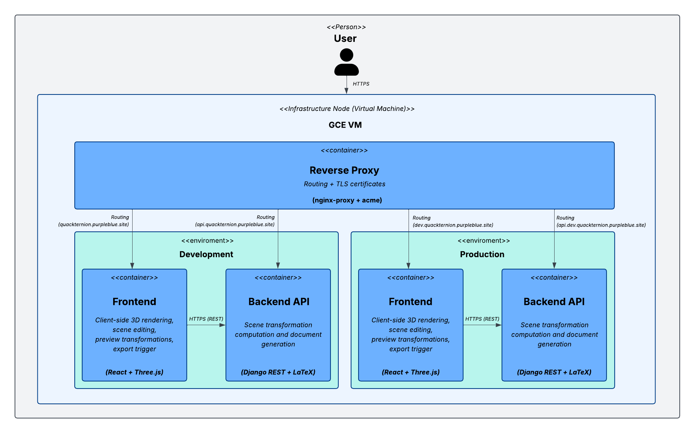
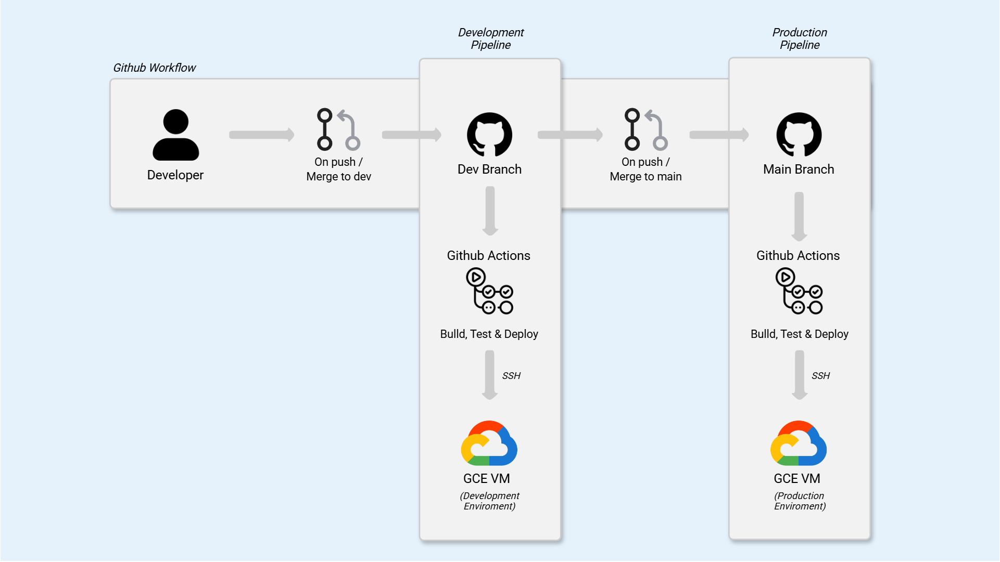

# Quackternion 
<!--  -->

Quackternion is a 3D simulation platform for applying and visualizing spatial transformations using quaternions. The system focuses on mathematically correct modeling of rotations and reference frames, providing real-time client-side interaction while generating deterministic, backend-authored exports (PDF/LaTeX).

Quackternion helps engineers and students understand, apply, and verify 3D spatial transformations by combining interactive visualization with mathematically explicit, reproducible exports.

   

## Table of Contents
- [Overview](#quackternion)
- [Problem & Motivation](#problem--motivation)
- [System Architecture](#system-architecture)
- [Workflow](#workflow)
- [Key Features](#requirements)
- [Stack](#stack)
- [Design Decisions](#design-decisions)
- [Deployment](#deployment)
- [Project Status](#project-status)
- [What I Learned](#what-i-learned)
- [Diagrams](#diagrams)

## Problem & Motivation

Understanding and applying 3D spatial transformations is a common challenge in engineering, robotics, and computer graphics, especially when moving from intuitive rotations to mathematically sound representations such as homogeneous transformations and quaternions.

While many tools focus primarily on visualization, they often hide the underlying mathematical process, making it difficult to reason about how transformations are composed and applied in real systems.

Quackternion was created to help visualize and understand spatial transformations while explicitly exposing the full mathematical procedure. The project originated from studying kinematic chains and trajectory control for robotic arms, where precise and verifiable transformations are critical.

## System Architecture

The system follows a backend-driven workflow with a clear separation of responsibilities:

- **Frontend (React + Three.js)** provides real-time 3D rendering and immediate feedback:
  - Applies transformations client-side to keep the experience responsive
  - Displays current values (position, Euler angles, quaternion) during editing
  - Stores the scene state in the browser (localStorage)

- **Backend (Django REST)** acts as the authoritative computation and export layer:
  - Validates scene payloads via DRF serializers
  - Recomputes transformations using a deterministic quaternion pipeline
  - Generates export artifacts (PDF or LaTeX) and returns them as downloadable files

<!-- - **Persistence / infra**
  - PostgreSQL is used in production (SQLite in local development)
  - LaTeX compilation runs inside the backend container for reproducible outputs
  - Services run via Docker Compose behind an Nginx reverse proxy with automatic TLS -->

Detailed system, infrastructure, and container diagrams are included below.

### Container Diagram (C4 Model - Level 2)

   

## Workflow

1. Users create and edit objects and transformations in the UI (client-side rendering).
2. The frontend stores the current scene state locally and displays live computed values.
3. When exporting, the UI sends a full scene snapshot to the backend via `POST /api/procedure/`.
4. The backend validates the payload, recomputes transformations, and returns a file response
   (PDF exposed in the UI, PDF/LaTeX supported by the API).

## Requirements

### Functional Requirements

These requirements describe **what the system does**.

- The system shall allow users to create and edit 3D objects with explicit reference frames.
- The system shall support translation and rotation transformations using quaternions.
- The system shall display real-time visual feedback of object position, orientation, and quaternion values.
- The system shall allow chaining multiple transformations in a deterministic order.
- The system shall generate the full mathematical procedure associated with a scene.
- The system shall export the transformation procedure as a PDF via the user interface.
- The system shall support exporting the procedure as a LaTeX document through the backend API.
- The system shall recompute all transformations on the backend using a complete scene snapshot.

---

### Non-Functional Requirements

These requirements describe **how the system behaves**.

- Deterministic behavior: identical inputs shall always produce identical outputs.
- Reproducibility: exported documents shall be independent of client-side execution or environment.
- Clear separation of concerns between visualization (frontend) and authoritative computation (backend).
- Low-latency interaction through client-side 3D rendering.
- Environment-independent document generation using containerized LaTeX tooling.
- Reproducible deployments across environments using Docker and Docker Compose and automated deployment via CI/CD pipelines.

## Stack

**Mathematical Knowledge:**

 

**Backend:**

 
 
  

**Frontend:**

 
 
 
 

<!-- **DB:** SQLite (dev) / Postgres (prod) 

  -->

**Infra:** Docker + Docker Compose, Nginx (nginx-proxy + acme), GitHub Actions, GCP VM  

 
 

## Design Decisions

The following decisions reflect a deliberate tradeoff between correctness,
developer experience, and system simplicity:

- Quaternions were chosen over Euler angles to avoid gimbal lock and provide stable rotational composition.
- All core mathematical computations are recomputed on the backend to ensure consistency between interactive visualization and exported results.
- 3D scene rendering is executed client-side to minimize latency, improve user experience, and avoid unnecessary server-side rendering overhead.
- LaTeX and PDF generation is performed inside the backend container to guarantee deterministic, environment-independent outputs.
- Docker Compose was used to model service relationships and enable reproducible deployments.
- Django REST Framework was selected to prioritize development velocity, clarity of API boundaries, and maintainability for an educational, non-commercial platform, where extreme horizontal scalability is not a primary requirement.
- A single backend endpoint orchestrates the full procedure (validate → compute → export) to keep the workflow deterministic and reproducible.
- drf-spectacular is used to maintain explicit API documentation (Swagger/Redoc) as the contract between the frontend and backend.
- The UI computes and displays live values for immediate feedback, while the backend recomputes results from immutable scene snapshots (stored locally during editing) to produce deterministic
  exports without trusting client-side calculations.
- Reference frames are modeled explicitly to support chained transformations and kinematic-style reasoning.
- The UI currently exposes PDF export to keep the workflow simple for users, while the backend API already supports LaTeX exports for advanced or future use cases.

## Deployment

The deployment strategy prioritizes reproducibility, isolation, and minimal manual intervention. The system is deployed using two isolated environments: **development** and **production**.

- Pushes to the `dev` branch trigger a CI/CD pipeline that builds all Docker images, performs lightweight validation, and deploys the system to the development environment.
- Merges into the `main` branch trigger the same pipeline, deploying the application to the production environment.
- Deployments are executed remotely over SSH, using Docker Compose to rebuild and restart services.
- Both environments run on Google Cloud virtual machines behind a shared Nginx reverse proxy layer (nginx-proxy + acme companion) that provides routing and automatic TLS certificates for both frontend and backend domains.
- GitHub Actions is used to automate build, test, and deployment workflows.

   

## Project Status

The project is currently in a stable maintenance phase. Core functionality is complete and
the system is operational in production. Future work may include additional transformation
models and extended support for homogeneous matrix-based workflows.

## What I Learned

- Applying quaternion-based spatial transformations in a real system context
- Designing backend-driven simulations with deterministic and reproducible outputs
- Integrating mathematical rendering pipelines (LaTeX/PDF) into production backends
- Balancing client-side rendering performance with backend authority over system state
- Making pragmatic architectural tradeoffs based on project goals and constraints

## Diagrams

<!-- ### Context Diagram (C4 Model - Level 1)

 -->

<!-- ### Container Diagram (C4 Model - Level 2)

   

 -->

<!-- ### Procedure Sequence

 -->

### User Cases Diagram

   

### Domain / Class Diagram

  

<!-- ### CI/CD Pipelines

   

 -->

